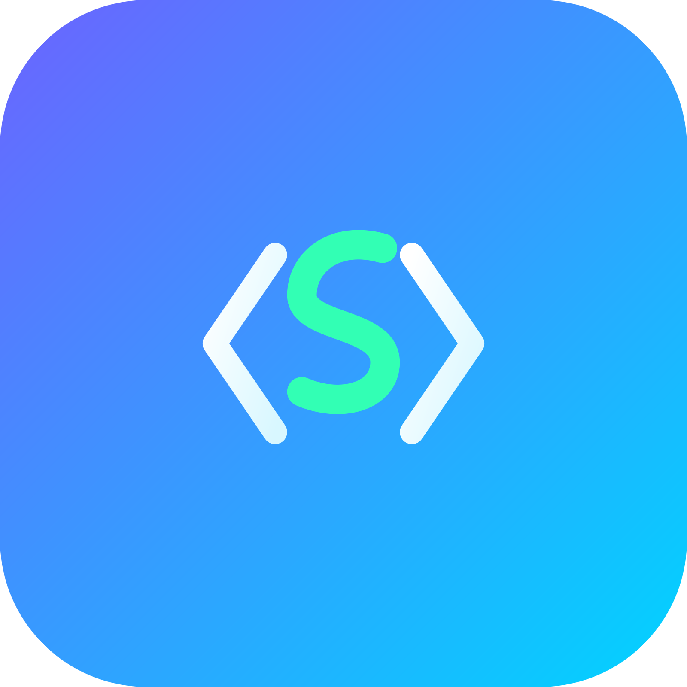

# SuperCode IDE



**SuperCode IDE** è un editor di codice desktop leggero sviluppato con **Electron**.

Permette di aprire, modificare e salvare file di codice tramite un'interfaccia semplice e veloce.

---

## ✨ Funzionalità

* 📝 Editor di codice
* 📂 Apertura file
* 💾 Salvataggio file
* 📌 Icona nella Tray
* 🖱️ Menu contestuale
* ⚡ Applicazione desktop basata su Electron

---

## 📥 Installazione

Vai nella sezione **Releases** della repository e scarica l'ultima versione.

Dopo il download:

1. Avvia l'installer (`supercode-ide-1.0.0 Setup.exe`)
   **oppure**
2. Avvia direttamente il file `.exe` dell'applicazione

Segui le istruzioni di installazione e avvia SuperCode IDE.

---

## 🛠️ Avvio da sorgente

Requisiti:

* Node.js
* npm

Installa le dipendenze:

```bash
npm install
```

Avvia l'app:

```bash
npm start
```

---

## 🔨 Compilazione

Per creare la versione installabile:

```bash
npm run make
```

I file generati saranno nella cartella:

```text
out/
```

---

## 🧰 Tecnologie

* Electron
* JavaScript
* HTML
* CSS
* Node.js

---

## 📄 Licenza

MIT License

---

## 👨‍💻 Autore

Creato da Matteo.
